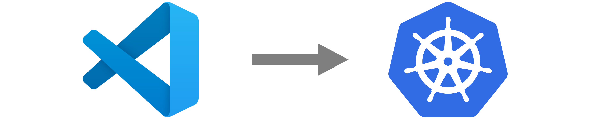
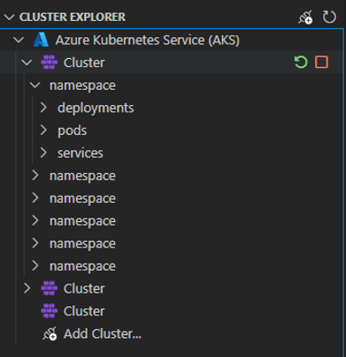
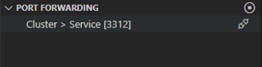
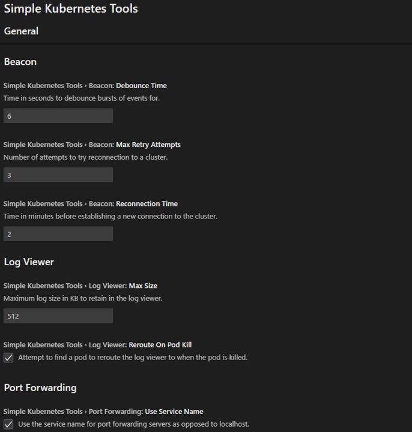

# Simple Kubernetes Tools for VS Code

A Visual Studio Code extension that provides an easy way to view perform simple actions on your Kubernetes Clusters.  

You can perform simple actions such as:
* Restart Deployments
* View Real-time Logs and Export Them
* Start, Stop and Restart Clusters (provider-specific)

    

* Port Forward Services

    

## Providers

This extension currently only supports Azure Kubernetes Services via the `AzureCliCredential`. Please ensure your Azure CLI is authenticated correctly by running `az login` in a terminal. 

I may add support for other cloud providers in the future.

## Basic Settings

This is a sample of some settings available to be configured: 

* **Auto Connect to Clusters**
    * Determine whether clusters are connected to upon launching the extension. Default value is `false`. 

* **Reroute Logs on Pod Kill**
    * Determine if the extension should try to reroute an active log session to a new pod when the current pod is terminated. Default value is `true`.

* **Use Service Name for Port Forwarding**
    * Determine whether service names or `localhost` should be used for port forwarding sessions. Defalt value is `true`.

There are other advanced settings available too - these are to be changed at your own risk.

## Notes
This extension primarily exists as a personal project (my first proper extension) that is used with my own projects. It is under development and is currently missing tests (these will follow soon). Features maybe added or modified in the future. I may also add support for other cloud providers.